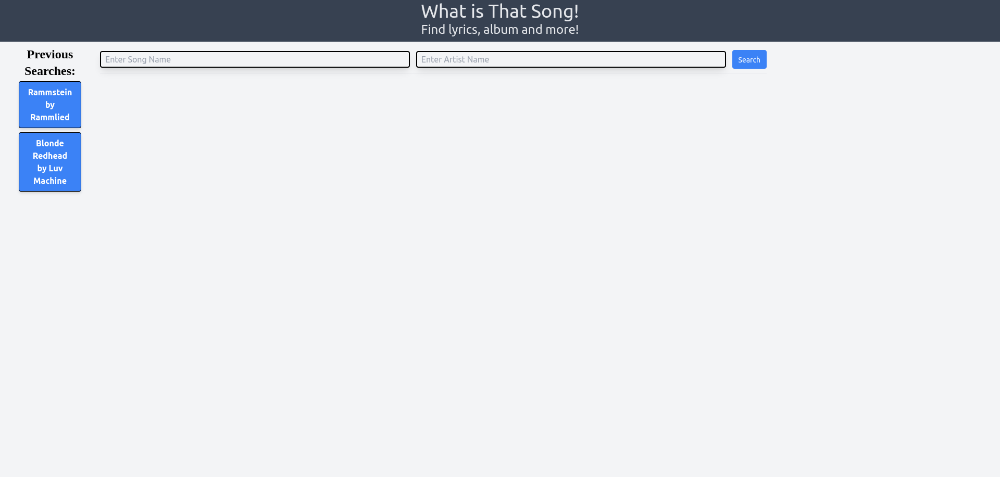

# What is That Song

A website to find the lyrics to a song and show metadata about the song  
Our web application will find and display:
<ul>
  <li>Song's lyrics
   <li>Album
   <li>Album Art
   <li>Track time
   <li>Number of plays on LastFM  
    
 Our application will also keep a history in localStorage of previous searches and generate buttons for easy access!  
 Any errors such as failure to get fetch data is displayed via Modal

## By: Victor Weinert, Alex McDaniel & Ean Rodriguez

## Technologies Used:

jQuery

Tailwind CSS Framework

## APIs used

https://www.last.fm/api

https://happi.dev/docs/music

## Link

Live @ https://vw0389.github.io/what-is-that-song/